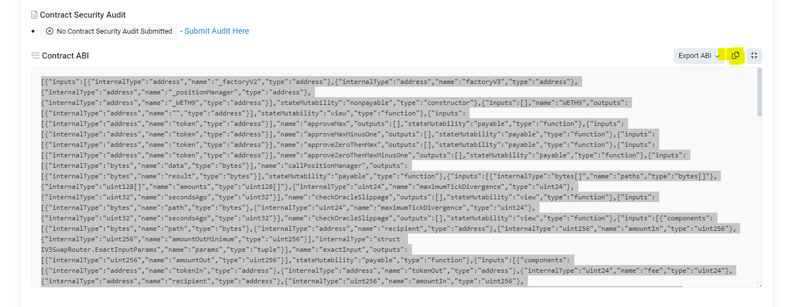
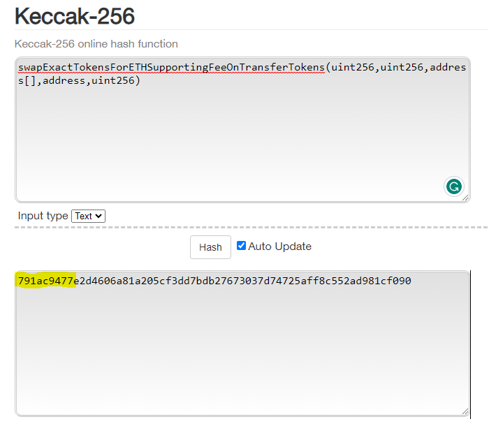
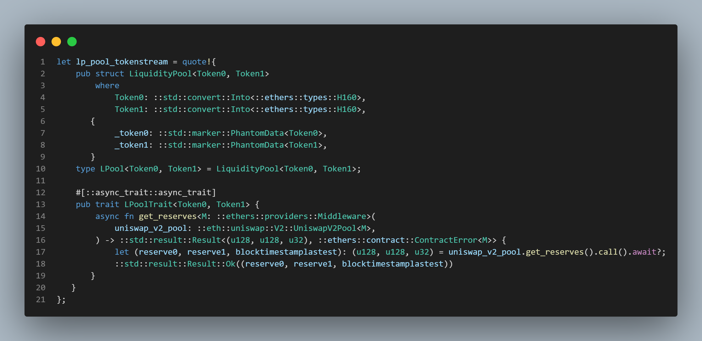

# Learnings

Collation of all the learning points.

# Learning One

# Problem Statement
Error encountered running `cargo test` (trying to do integration testing? Not really because it is more like unit testing but placed in a separate `tests` folder):
```
error[E0432]: unresolved import `ether_rs_utils::abigen::contracts::uniswap::SwapExactTokensForETHSupportingFeeOnTransferTokensCall`
 --> tests\test_decode.rs:3:5
  |
3 | use ether_rs_utils::abigen::contracts::uniswap::SwapExactTokensForETHSupportingFeeOnTransferTokensCall;
  |     ^^^^^^^^^^^^^^^^^^^^^^^^^^^^^^^^^^^^^^^^^^^^^^^^^^^^^^^^^^^^^^^^^^^^^^^^^^^^^^^^^^^^^^^^^^^^^^^^^^ no `SwapExactTokensForETHSupportingFeeOnTransferTokensCall` in `abigen::contracts::uniswap`
```

It seems like the `uniswap_abi.json` didn't result in the correct macro (i.e. `abigen!()`) expansion such that it should result in the existence of a function in `ether_rs_utils::abigen::contracts::uniswap` with the name `SwapExactTokensForETHSupportingFeeOnTransferTokensCall`.

# Solution / Learning(s)
After several tries, it seems clear that the issue is with the `uniswap.abi`.

The correct `uniswap.abi` is as follows:
```
[{"inputs":[{"internalType":"address","name":"_factory","type":"address"},{"internalType":"address","name":"_WETH","type":"address"}],"stateMutability":"nonpayable","type":"constructor"},{"inputs":[],"name":"WETH","outputs":[{"internalType":"address","name":"","type":"address"}],"stateMutability":"view","type":"function"},{"inputs":[{"internalType":"address","name":"tokenA","type":"address"},{"internalType":"address","name":"tokenB","type":"address"},{"internalType":"uint256","name":"amountADesired","type":"uint256"},{"internalType":"uint256","name":"amountBDesired","type":"uint256"},{"internalType":"uint256","name":"amountAMin","type":"uint256"},{"internalType":"uint256","name":"amountBMin","type":"uint256"},{"internalType":"address","name":"to","type":"address"},{"internalType":"uint256","name":"deadline","type":"uint256"}],"name":"addLiquidity","outputs":[{"internalType":"uint256","name":"amountA","type":"uint256"},{"internalType":"uint256","name":"amountB","type":"uint256"},{"internalType":"uint256","name":"liquidity","type":"uint256"}],"stateMutability":"nonpayable","type":"function"},{"inputs":[{"internalType":"address","name":"token","type":"address"},{"internalType":"uint256","name":"amountTokenDesired","type":"uint256"},{"internalType":"uint256","name":"amountTokenMin","type":"uint256"},{"internalType":"uint256","name":"amountETHMin","type":"uint256"},{"internalType":"address","name":"to","type":"address"},{"internalType":"uint256","name":"deadline","type":"uint256"}],"name":"addLiquidityETH","outputs":[{"internalType":"uint256","name":"amountToken","type":"uint256"},{"internalType":"uint256","name":"amountETH","type":"uint256"},{"internalType":"uint256","name":"liquidity","type":"uint256"}],"stateMutability":"payable","type":"function"},{"inputs":[],"name":"factory","outputs":[{"internalType":"address","name":"","type":"address"}],"stateMutability":"view","type":"function"},{"inputs":[{"internalType":"uint256","name":"amountOut","type":"uint256"},{"internalType":"uint256","name":"reserveIn","type":"uint256"},{"internalType":"uint256","name":"reserveOut","type":"uint256"}],"name":"getAmountIn","outputs":[{"internalType":"uint256","name":"amountIn","type":"uint256"}],"stateMutability":"pure","type":"function"},{"inputs":[{"internalType":"uint256","name":"amountIn","type":"uint256"},{"internalType":"uint256","name":"reserveIn","type":"uint256"},{"internalType":"uint256","name":"reserveOut","type":"uint256"}],"name":"getAmountOut","outputs":[{"internalType":"uint256","name":"amountOut","type":"uint256"}],"stateMutability":"pure","type":"function"},{"inputs":[{"internalType":"uint256","name":"amountOut","type":"uint256"},{"internalType":"address[]","name":"path","type":"address[]"}],"name":"getAmountsIn","outputs":[{"internalType":"uint256[]","name":"amounts","type":"uint256[]"}],"stateMutability":"view","type":"function"},{"inputs":[{"internalType":"uint256","name":"amountIn","type":"uint256"},{"internalType":"address[]","name":"path","type":"address[]"}],"name":"getAmountsOut","outputs":[{"internalType":"uint256[]","name":"amounts","type":"uint256[]"}],"stateMutability":"view","type":"function"},{"inputs":[{"internalType":"uint256","name":"amountA","type":"uint256"},{"internalType":"uint256","name":"reserveA","type":"uint256"},{"internalType":"uint256","name":"reserveB","type":"uint256"}],"name":"quote","outputs":[{"internalType":"uint256","name":"amountB","type":"uint256"}],"stateMutability":"pure","type":"function"},{"inputs":[{"internalType":"address","name":"tokenA","type":"address"},{"internalType":"address","name":"tokenB","type":"address"},{"internalType":"uint256","name":"liquidity","type":"uint256"},{"internalType":"uint256","name":"amountAMin","type":"uint256"},{"internalType":"uint256","name":"amountBMin","type":"uint256"},{"internalType":"address","name":"to","type":"address"},{"internalType":"uint256","name":"deadline","type":"uint256"}],"name":"removeLiquidity","outputs":[{"internalType":"uint256","name":"amountA","type":"uint256"},{"internalType":"uint256","name":"amountB","type":"uint256"}],"stateMutability":"nonpayable","type":"function"},{"inputs":[{"internalType":"address","name":"token","type":"address"},{"internalType":"uint256","name":"liquidity","type":"uint256"},{"internalType":"uint256","name":"amountTokenMin","type":"uint256"},{"internalType":"uint256","name":"amountETHMin","type":"uint256"},{"internalType":"address","name":"to","type":"address"},{"internalType":"uint256","name":"deadline","type":"uint256"}],"name":"removeLiquidityETH","outputs":[{"internalType":"uint256","name":"amountToken","type":"uint256"},{"internalType":"uint256","name":"amountETH","type":"uint256"}],"stateMutability":"nonpayable","type":"function"},{"inputs":[{"internalType":"address","name":"token","type":"address"},{"internalType":"uint256","name":"liquidity","type":"uint256"},{"internalType":"uint256","name":"amountTokenMin","type":"uint256"},{"internalType":"uint256","name":"amountETHMin","type":"uint256"},{"internalType":"address","name":"to","type":"address"},{"internalType":"uint256","name":"deadline","type":"uint256"}],"name":"removeLiquidityETHSupportingFeeOnTransferTokens","outputs":[{"internalType":"uint256","name":"amountETH","type":"uint256"}],"stateMutability":"nonpayable","type":"function"},{"inputs":[{"internalType":"address","name":"token","type":"address"},{"internalType":"uint256","name":"liquidity","type":"uint256"},{"internalType":"uint256","name":"amountTokenMin","type":"uint256"},{"internalType":"uint256","name":"amountETHMin","type":"uint256"},{"internalType":"address","name":"to","type":"address"},{"internalType":"uint256","name":"deadline","type":"uint256"},{"internalType":"bool","name":"approveMax","type":"bool"},{"internalType":"uint8","name":"v","type":"uint8"},{"internalType":"bytes32","name":"r","type":"bytes32"},{"internalType":"bytes32","name":"s","type":"bytes32"}],"name":"removeLiquidityETHWithPermit","outputs":[{"internalType":"uint256","name":"amountToken","type":"uint256"},{"internalType":"uint256","name":"amountETH","type":"uint256"}],"stateMutability":"nonpayable","type":"function"},{"inputs":[{"internalType":"address","name":"token","type":"address"},{"internalType":"uint256","name":"liquidity","type":"uint256"},{"internalType":"uint256","name":"amountTokenMin","type":"uint256"},{"internalType":"uint256","name":"amountETHMin","type":"uint256"},{"internalType":"address","name":"to","type":"address"},{"internalType":"uint256","name":"deadline","type":"uint256"},{"internalType":"bool","name":"approveMax","type":"bool"},{"internalType":"uint8","name":"v","type":"uint8"},{"internalType":"bytes32","name":"r","type":"bytes32"},{"internalType":"bytes32","name":"s","type":"bytes32"}],"name":"removeLiquidityETHWithPermitSupportingFeeOnTransferTokens","outputs":[{"internalType":"uint256","name":"amountETH","type":"uint256"}],"stateMutability":"nonpayable","type":"function"},{"inputs":[{"internalType":"address","name":"tokenA","type":"address"},{"internalType":"address","name":"tokenB","type":"address"},{"internalType":"uint256","name":"liquidity","type":"uint256"},{"internalType":"uint256","name":"amountAMin","type":"uint256"},{"internalType":"uint256","name":"amountBMin","type":"uint256"},{"internalType":"address","name":"to","type":"address"},{"internalType":"uint256","name":"deadline","type":"uint256"},{"internalType":"bool","name":"approveMax","type":"bool"},{"internalType":"uint8","name":"v","type":"uint8"},{"internalType":"bytes32","name":"r","type":"bytes32"},{"internalType":"bytes32","name":"s","type":"bytes32"}],"name":"removeLiquidityWithPermit","outputs":[{"internalType":"uint256","name":"amountA","type":"uint256"},{"internalType":"uint256","name":"amountB","type":"uint256"}],"stateMutability":"nonpayable","type":"function"},{"inputs":[{"internalType":"uint256","name":"amountOut","type":"uint256"},{"internalType":"address[]","name":"path","type":"address[]"},{"internalType":"address","name":"to","type":"address"},{"internalType":"uint256","name":"deadline","type":"uint256"}],"name":"swapETHForExactTokens","outputs":[{"internalType":"uint256[]","name":"amounts","type":"uint256[]"}],"stateMutability":"payable","type":"function"},{"inputs":[{"internalType":"uint256","name":"amountOutMin","type":"uint256"},{"internalType":"address[]","name":"path","type":"address[]"},{"internalType":"address","name":"to","type":"address"},{"internalType":"uint256","name":"deadline","type":"uint256"}],"name":"swapExactETHForTokens","outputs":[{"internalType":"uint256[]","name":"amounts","type":"uint256[]"}],"stateMutability":"payable","type":"function"},{"inputs":[{"internalType":"uint256","name":"amountOutMin","type":"uint256"},{"internalType":"address[]","name":"path","type":"address[]"},{"internalType":"address","name":"to","type":"address"},{"internalType":"uint256","name":"deadline","type":"uint256"}],"name":"swapExactETHForTokensSupportingFeeOnTransferTokens","outputs":[],"stateMutability":"payable","type":"function"},{"inputs":[{"internalType":"uint256","name":"amountIn","type":"uint256"},{"internalType":"uint256","name":"amountOutMin","type":"uint256"},{"internalType":"address[]","name":"path","type":"address[]"},{"internalType":"address","name":"to","type":"address"},{"internalType":"uint256","name":"deadline","type":"uint256"}],"name":"swapExactTokensForETH","outputs":[{"internalType":"uint256[]","name":"amounts","type":"uint256[]"}],"stateMutability":"nonpayable","type":"function"},{"inputs":[{"internalType":"uint256","name":"amountIn","type":"uint256"},{"internalType":"uint256","name":"amountOutMin","type":"uint256"},{"internalType":"address[]","name":"path","type":"address[]"},{"internalType":"address","name":"to","type":"address"},{"internalType":"uint256","name":"deadline","type":"uint256"}],"name":"swapExactTokensForETHSupportingFeeOnTransferTokens","outputs":[],"stateMutability":"nonpayable","type":"function"},{"inputs":[{"internalType":"uint256","name":"amountIn","type":"uint256"},{"internalType":"uint256","name":"amountOutMin","type":"uint256"},{"internalType":"address[]","name":"path","type":"address[]"},{"internalType":"address","name":"to","type":"address"},{"internalType":"uint256","name":"deadline","type":"uint256"}],"name":"swapExactTokensForTokens","outputs":[{"internalType":"uint256[]","name":"amounts","type":"uint256[]"}],"stateMutability":"nonpayable","type":"function"},{"inputs":[{"internalType":"uint256","name":"amountIn","type":"uint256"},{"internalType":"uint256","name":"amountOutMin","type":"uint256"},{"internalType":"address[]","name":"path","type":"address[]"},{"internalType":"address","name":"to","type":"address"},{"internalType":"uint256","name":"deadline","type":"uint256"}],"name":"swapExactTokensForTokensSupportingFeeOnTransferTokens","outputs":[],"stateMutability":"nonpayable","type":"function"},{"inputs":[{"internalType":"uint256","name":"amountOut","type":"uint256"},{"internalType":"uint256","name":"amountInMax","type":"uint256"},{"internalType":"address[]","name":"path","type":"address[]"},{"internalType":"address","name":"to","type":"address"},{"internalType":"uint256","name":"deadline","type":"uint256"}],"name":"swapTokensForExactETH","outputs":[{"internalType":"uint256[]","name":"amounts","type":"uint256[]"}],"stateMutability":"nonpayable","type":"function"},{"inputs":[{"internalType":"uint256","name":"amountOut","type":"uint256"},{"internalType":"uint256","name":"amountInMax","type":"uint256"},{"internalType":"address[]","name":"path","type":"address[]"},{"internalType":"address","name":"to","type":"address"},{"internalType":"uint256","name":"deadline","type":"uint256"}],"name":"swapTokensForExactTokens","outputs":[{"internalType":"uint256[]","name":"amounts","type":"uint256[]"}],"stateMutability":"nonpayable","type":"function"},{"stateMutability":"payable","type":"receive"}]
```

The ABI found on https://etherscan.io/address/0x68b3465833fb72A70ecDF485E0e4C7bD8665Fc45#code doesn't seem to work.



# Evidence supporting that the Solution is indeed correct or makes sense
1. Try changing the content of the `uniswap.abi`,  can even change it to an empty file, force a rebuild of the test binary by changing a small part of the codes, will see cargo test failing.
2. Change the content of the `uniswap.abi` back to the correct content, force a rebuild again, will then see cargo test passing. This proves it is indeed the correctness of the abi that results in the existence of the `SwapExactTokensForETHSupportingFeeOnTransferTokensCall` function.

# FAQs/Points for Learning One
1. Why once `cargo test` works, even after removing the content of `uniswap.abi`, `cargo test` still passes?

It is because removing the content of `uniswap.abi` does **NOT** trigger a rebuild of the test binary. So the binary that passes the test is still used for the test and hence passes the test still. To trigger a rebuild, need to change some parts of the codes in the repo, e.g. in `uniswap.rs`, change the line `abigen!(Uniswap, ...)` to `abigen!(UniswapV2, ...)`.

# Learning Two - How to know if the transaction is a say Uniswap transaction?

https://www.4byte.directory/signatures/

1. The first four bytes of the transaction is the function selector.
2. For the Uniswap function [`swapExactTokensForETHSupportingFeeOnTransferTokens`](https://docs.uniswap.org/contracts/v2/reference/smart-contracts/router-02#swapexacttokensforethsupportingfeeontransfertokens), the first four bytes of the `input data` of the corresponding transaction ('corresponding' meaning the transaction that is calling this function) is [`0x791ac947`](https://www.4byte.directory/signatures/?bytes4_signature=0x791ac947).
3. The function selector of any solidity function is the first four bytes of the OUTPUT of the keccak-256 hash function with the function signature (with `uint256` instead of purely `uint`) as input (in solidity: [`bytes4(keccak256(bytes(_func)))`](https://solidity-by-example.org/function-selector/)). (See annotated block under point 3 of `More references` below)

More references:
1. https://solidity-by-example.org/function-selector/
2. https://docs.soliditylang.org/en/v0.8.11/abi-spec.html#function-selector
3. https://docs.soliditylang.org/en/v0.8.11/abi-spec.html#examples - For an example of how the `input data` of a `transaction` looks like
4. https://ethereum.stackexchange.com/questions/72363/what-is-a-function-selector
```
The first four bytes of the call data for a function call specifies the function to be called. It is the first (left, high-order in big-endian) four bytes of the Keccak-256 (SHA-3) hash of the signature of the function. The signature is defined as the canonical expression of the basic prototype without data location specifier, i.e. the function name with the parenthesised list of parameter types. Parameter types are split by a single comma - no spaces are used.
```
5. https://emn178.github.io/online-tools/keccak_256.html



# Learning Three: Dissecting the `input_data` of the sample `Transaction`

For this particular function: `SwapExactTokensForETHSupportingFeeOnTransferTokensCall`.

|Idx| Name|  Type|  Data| Comments / Description|
|:---|:---|:---|:---|:---|
0|amountIn|uint256|35017684833000000000000000000|Number of shitcoins the user selling for ETH|
1|amountOutMin|uint256|214932004688480825|Minimum number of WEI the user wants to get from swapping his shitcoins (slippage)|
2|path|address[]|[0x6Ee9742d17B527e682248DCA85952e4Fe190061d, 0xC02aaA39b223FE8D0A0e5C4F27eAD9083C756Cc2]|First `0x6Ee9742d17B527e682248DCA85952e4Fe190061d` is the contract of the shitcoins, Second contract is `0xC02aaA39b223FE8D0A0e5C4F27eAD9083C756Cc2` which is the contract for `WETH` (it is reversed for say `swapETHForTokens` function, e.g. first address is contract address of `WETH`)|
3|to|address|0x88fE39999348e33956feb18f84dFe0241A33481b|The user's ETH address|
4|deadline|uint256|1686391996|UNIX timestamp of the expiry of this swap|

# Learning Four: Baking bytes into binary with macros

```
// $addr should be `tt` instead of `expr`
macro_rules! impl_into_address_for_tokens {
    ($($ticker:tt, $addr:tt);*) => {
        $(
            #[derive(::std::fmt::Debug, crate::serde::Deserialize, crate::serde::Serialize)]
            pub struct $ticker;

            // impl $ticker {
            //     pub const ADDRESS: crate::ethers::types::H160 = stringify!($addr)
            //     .parse::<crate::ethers::types::H160>()
            //     .expect(
            //         ::std::concat!{"ERROR: Unable to parse ", stringify!($ticker), " address into type `H160`",}
            //     );
            // }

            impl $ticker {
                pub const ADDRESS: crate::ethers::types::H160 = crate::unwrap_ok!(stringify!($addr)
                .parse::<crate::ethers::types::H160>()
                .map_err(|_| {
                    ::std::concat!{"ERROR: Unable to parse ", stringify!($ticker), " address into type `H160`"}
                }));
            }

            impl ::std::convert::Into<crate::ethers::types::H160> for $ticker {
                fn into(self) -> crate::ethers::types::H160 {
                    <$ticker>::ADDRESS
                }
            }

        )*
    };
}

// Expanded codes
#[derive(::std::fmt::Debug, crate::serde::Deserialize, crate::serde::Serialize)]
pub struct USDT;

impl USDT {
    pub const ADDRESS: crate::ethers::types::H160 =
        crate::unwrap_ok!(stringify!(0xdAC17F958D2ee523a2206206994597C13D831ec7)
            .parse::<crate::ethers::types::H160>()
            .map_err(|_| {
                ::std::concat! {
                  "ERROR: Unable to parse ",stringify!(USDT)," address into type `H160`"
                }
            }));
}
impl ::std::convert::Into<crate::ethers::types::H160> for USDT {
    fn into(self) -> crate::ethers::types::H160 {
        <USDT>::ADDRESS
    }
}

impl_into_address_for_tokens!(
    USDT, 0xdAC17F958D2ee523a2206206994597C13D831ec7;
    NEON, 0x6ee9742d17b527e682248dca85952e4fe190061d;
    WETH, 0xC02aaA39b223FE8D0A0e5C4F27eAD9083C756Cc2);
```

Not(?) possible to `parse` the `&str` as 'const' since the fn `parse` is not 'const'. The example in `const_panic::unwrap_ok()` uses a `const fn` anyway.

# Learning Four: Use of `crate::stmt_in_proc_macro_crate::stmt_else` in `quote!()` 



When running `cargo run` in `ethers-rs-test`, the following error appears:

```
error[E0433]: failed to resolve: could not find `eth` in the list of imported crates
 --> crates\ethers-rs-test\src\main.rs:6:5
  |
6 |     impl_token_lp!(UniswapV2AMM, "data.csv");
  |     ^^^^^^^^^^^^^^^^^^^^^^^^^^^^^^^^^^^^^^^^ could not find `eth` in the list of imported crates
  |
  = note: this error originates in the macro `impl_token_lp` (in Nightly builds, run with -Z macro-backtrace for more info)
```

`cargo expand` expands into something like so:
```
 fn get_reserves<'async_trait, M>(
            uniswap_v2_pool: ::eth::uniswap::V2::UniswapV2Pool<M>,
        ) ->
```

which means probably Rust doesn't know what is `::eth::...` in `ethers-rs-test`.

Solution (at least for now)? Need to create a new crate in the workspace named `ethers-abigen-types` to store the types created by `ethers::abigen!`.

# Anyway, FOR MY CASE ONLY: putting abigen-created types in `ethers-proc-macro` is also useless since proc-macro crates **CANNOT** export any other stuff other than proc-macro, means the types defined inside `ethers-proc-macro` totally cannot be used!!!

However, for proc-macro that does need refer to types created within that proc-macro crate, this is still a major problem.

References:
https://stackoverflow.com/questions/44950574/using-crate-in-rusts-procedural-macros
https://crates.io/crates/proc-macro-crate